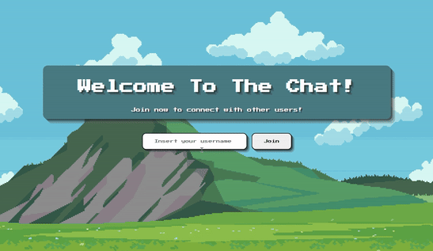

# 💻 Chat Application


## Description

This project is a simple chat application built with Java and Javalin for the backend and HTML, CSS, and JavaScript for the frontend. Users can join the chat, send messages, and see other users' messages in real time.

## Features

- Real-time chat functionality using WebSockets.
- User registration with dynamic username assignment.
- Message broadcasting to all connected users.
- User join and leave notifications.
- Basic user interface with a chat window and input fields.


## Technologies Used

- **Backend**: Java, Javalin
- **Frontend**: HTML, CSS, JavaScript
- **Build Tool**: Maven
- **WebSocket**: Javalin WebSocket

## How to Use
```bash
1) git clone https://github.com/angelinakumanova/small-web-projects.git

2) cd small-web-projects/01-Chat-Application
```

Load in IntelliJ or similar IDE and run the program (right-click in the ChatServer class, which is located in **src/main/java folder**, and press Run ChatServer.main()).

After the program is running, open your browser and go to **localhost:7070**.

# Demo
**Logging in**
--


**Attempting to log in with a username that already exists**
--



**Interaction between users and join/leave notifications**
--


